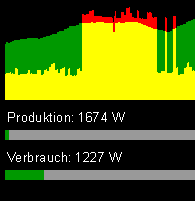

# OpenWB PV

The wallbox "OpenWB" connects to various components used in households with photovoltaic generators, like inverters and
energy meters. Aside from adjusting charging power for a connected car, the data is also republished using MQTT.

This example shows how the data supplied by OpenWB can be used to visualize the households' electricity generation and
electricity consumption.

How to use
----------
Just replace the variables `maxProduction`, `maxConsumption` and the MQTT-Plugins `Server` in the openwb-pv.ini

Result
------

